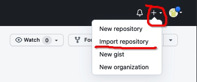
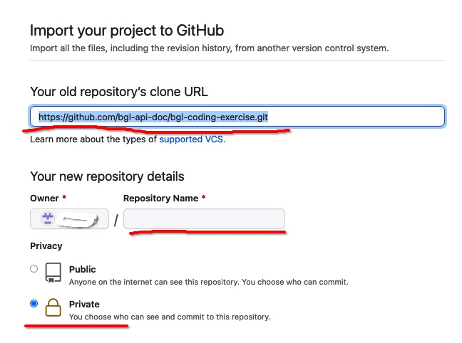
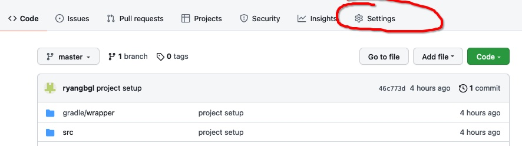
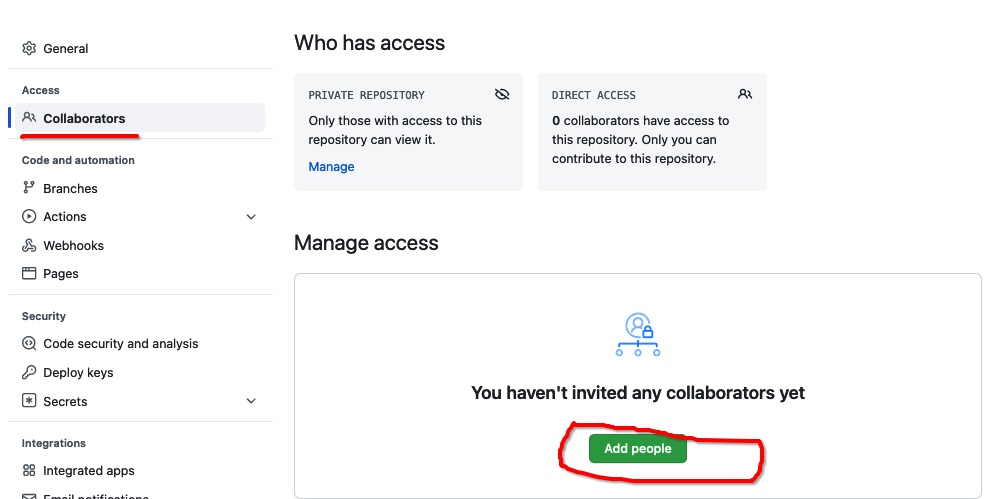

# BGL Coding Exercise - Game Of Life

Welcome to the BGL Coding Exercise. We appreciate you taking the time to complete this assignment, and we're excited about the prospect of you joining the team!

The goal of this assignment is to get a sense of how you think and solve problems. If you're having any issues running the project, please don't hesitate to contact us.

## How it works

- In [Github](https://github.com), please import this project into your account



- In import settings dialog:
  - old repository clone url: https://github.com/bgl-api-doc/bgl-coding-exercise.git
  - give the repo a new name
  - make it private



- Once you finish the exercise, please invite the user we mentioned in the email to your new repo




## Rule of Conway's Game of Life.

Given a 200*200 square cells, each cell is in one of two possible states, alive or dead, or "populated" or "unpopulated". Every cell interacts with its eight neighbours, which are the cells that are horizontally, vertically, or diagonally adjacent. At each step in time, the following transitions occur:

- Any live cell with fewer than two live neighbours dies in the next generation as if caused by underpopulation.
- Any live cell with two or three live neighbours lives on to the next generation.
- Any live cell with more than three live neighbours dies in the next generation, as if by overpopulation.
- Any dead cell with exactly three live neighbours becomes a live cell in the next generation, as if by reproduction.

The requirement of the coding exercise:

Given a 200*200 matrix and the coordinates of initial live cells, please implement a program to output the next 100 states according to Conway's Game of Life.

eg.
- Scenario 1
  - intput:
```groovy
[[1, 1]]
```
  - Output of the next 100 state:
```groovy
[]
```

- Scenario 2
  - input:
  ```groovy
  [[5, 5], [6, 5], [7, 5], [5, 6], [6, 6], [7, 6]]
  ```
  - output of the next 100 state:
```groovy
1: [[5, 5], [6, 4] [7, 5], [5, 6], [6, 7], [7, 6]]
2: [[5, 5], [6, 4] [7, 5], [5, 6], [6, 7], [7, 6]]
3: [[5, 5], [6, 4] [7, 5], [5, 6], [6, 7], [7, 6]]
...
```  

## Notes:
1. Parsing the input, eg. getting input from the terminal as a string and parsing it to an array is not our focus. You are free to design the application to take any java data types (eg. array of arrays) as the input of your solution.
2. This project serves as the starting point of your program. So feel free to change any codes.
3. You can run the program by executing the test task:
```shell
./gradlew test
```
4. You can import this project to your favourite IDE (IntelliJ, Eclipse, VS Code).
